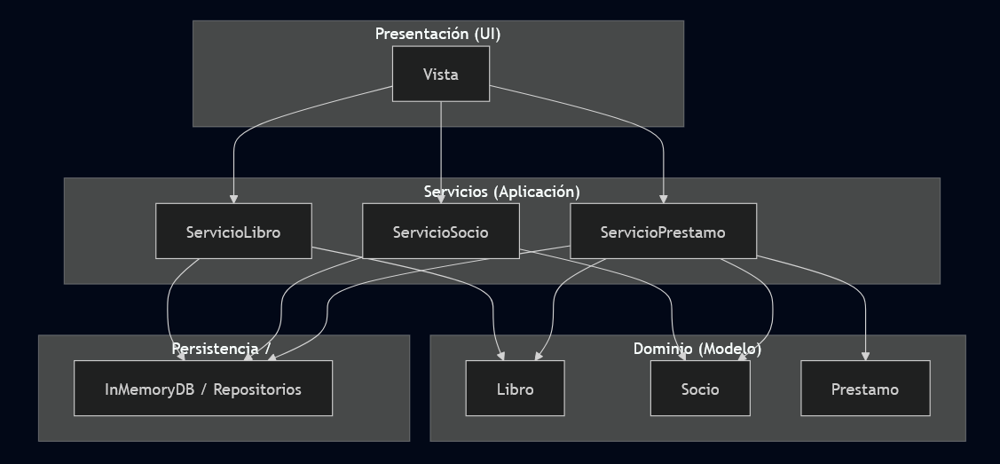
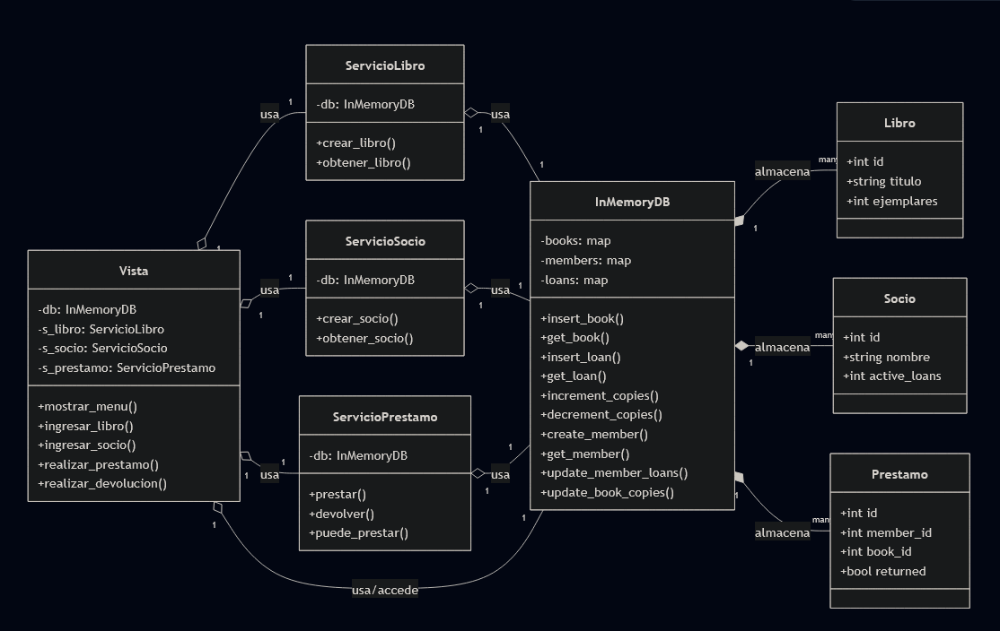

# Propósito y alcance

Este documento proporciona una introducción de alto nivel a la base de código del sistema de gestión de bibliotecas. Describe el propósito del sistema, identifica los principales componentes arquitectónicos y explica cómo interactúan para ofrecer la funcionalidad principal. Esta visión general sirve como punto de entrada para comprender la estructura de la base de código antes de sumergirse en subsistemas específicos.

# Descripción arquitectónica

El sistema implementa una arquitectura estricta de tres capas con dependencias unidireccionales que fluyen de arriba a abajo. La arquitectura impone una clara separación de las preocupaciones donde las capas superiores dependen de las capas inferiores, pero nunca viceversa.

## Relación de capas

### Principios Arquitectónicos Clave:

| Principio | Aplicación |
| :--- | :--- |
| Separación de responsabilidades | Cada capa tiene una responsabilidad única y bien definida |
| Dependencias Unidireccionales | Presentación → Lógica de negocio → Datos|
| Contexto de datos compartidos | Todos los servicios comparten una sola instancia de `InMemoryDB` |
|Inyección de dependencia |	Los componentes reciben dependencias a través de los parámetros del constructor |
| Objetos de dominio inmutables | Las entidades de dominio son simples clases de datos de Python |

## Diagrama de clases

## Diagrama de dominio

# Marco de Prueba e Infraestructura

La infraestructura de pruebas se implementa en
`src/tests/test_biblioteca.py` Uso del estándar del framework unittest de Python. La suite de prueba sigue los mismos patrones arquitectónicos que el sistema de producción, asegurando que las pruebas validen los escenarios de integración realistas.

## Dependencias de pruebas compartidas
El metodo setUp `src/tests/test_biblioteca.py` instancia a una sola instancia de InMemoryDB y la inyecta en todos los objetos de servicio. Esto refleja la arquitectura de producción donde todos los componentes comparten una única instancia de base de datos, asegurando que las pruebas validen el comportamiento de integración real en lugar de burlas aisladas.

|Componente	|Propósito	|
| :--- | :--- | 
|self.db|	Almacén de datos compartidos	
|self.slib|	Servicio de gestión de libros	
|self.ssoc|	Servicio de gestión de miembros	
|self.spre|	Servicio de gestión de préstamos	

## Accesorios de datos de prueba
Cada ejecución de prueba comienza con un estado inicial estático  `src/tests/test_biblioteca.py`:

- Libro 1 (self.b1): "Código limpio" con 2 copias disponibles
- Libro 2 (self.b2): "No Stock" con 0 copias disponibles (caja de borde para escenarios fuera de stock)
- Miembro 1 (self.m1): "Ana" con 0 préstamos activos
- Miembro 2 (self.m2): "Luis" con 0 préstamos activos

Este diseño permite pruebas inmediatas de escenarios de éxito y fracaso sin configuración adicional en pruebas individuales.